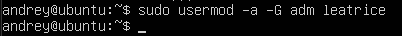
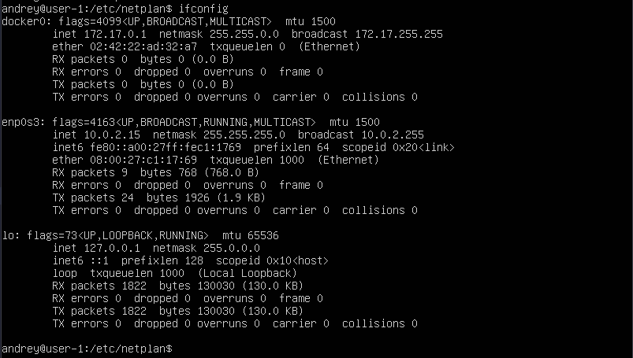
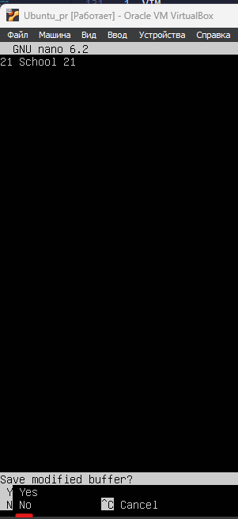

# Отчет D01_Linux-1 leatrice

## Part 1. Установка ОС


- Вывод версии операционной системы Ubuntu

## Part 2. Создание пользователя

- Вызов команды для создания пользовыателя


- Вызов команды для добавления созданного пользователя к группе adm



Описание опций:

* -a - добавляет пользователя в указанную группу без удаления из других групп. 

* -G - определяет группы, в которые нужно добавить пользователя. 

- Вывод команды cat /etc/passwd


## Part 3. Настройка сети ОС

* С помощью текстового редактора nano поменяем название hostname на user-1

```
sudo nano /etc/hostname
```


* УЗнаем установленный часовой пояс 

```
timedatectl
```


* Меняем часовой пояс и проверяем


* Установим утитлиту ifconfig (interface configuration) используется в операционной системе Linux для настройки и администрирования сетевых интерфейсов. Она позволяет просматривать и изменять настройки сетевых устройств, таких как IP-адрес, маска подсети, шлюз по умолчанию, а также настраивать различные параметры сети.

```
sudo apt-get install net-tools
```


* Выполним команду ifconfig

* Название сетевый интерфейсов
    * lo (loopback device) - виртуальный интерфейс, присутсвующий по умолчанию в любой Linux. Он используется для откладки сетевых программ и запуска серверных приложений на локальной машине. С этим интерфейсом всегда связан адрес 127.0.0.1.


* Используем кносольную команду для получения ip адреса устройства, на котором работаем от DHCP сервера

```
cat /var/lib/dhcp/dhcp.leases
```


* DHCP расшифровывается как "Dynamic Host Configuration Protocol" (Протокол динамической конфигурации хоста) и представляет собой сетевой протокол, который позволяет компьютерам автоматически получать IP-адреса, маски подсети, шлюзы по умолчанию и другие сетевые настройки от DHCP-сервера в локальной сети.
Вместо ручной настройки сетевых параметров на каждом компьютере в сети, DHCP упрощает процесс, предоставляя централизованный сервер, который автоматически назначает и обновляет сетевые настройки для устройств в сети.

* Определими и выведим на экран внешний ip-адрес шлюза (ip) и внутренний IP-адрес шлюза, он же ip-адрес по умолчанию (gw). 

* Узнаем внешний ip с помощью сервиса cutlmyip.ru


* Узнаем внутренний ip шлюза


* Зададим статичные (заданные вручную, а не полученные от DHCP сервера) настройки ip, gw, dns (используй публичный DNS серверы, например 1.1.1.1 или 8.8.8.8), для этого изменим файл по адресу /etc/entplan/00-installer-config.yaml


* Далее выполним команды

```
sudo netplan apply
sudo netplan try
```

* sudo netplan apply: эта команда немедленно применяет изменения в конфигурации сети. Она перезагружает настройки сети, используя новую конфигурацию без задержки.

* sudo netplan try: она позволяет вам проверить новую конфигурацию сети перед применением.

* Проверям, что мы получили статические IP-адреса



* Пингуем ya.ru для проверки корректности изменний 


## Part 4. Обновление ОС

```
sudo apt-get update
sudo apt-get upgrade
sudo apt-get dist-upgrate
```


* sudo apt-get update: эта команда используется в Linux для обновления списка пакетов, доступных для установки.

* sudo apt-get upgrade: эта команда используется для обновления установленных пакетов до их последних доступных версий.

* sudo apt-get dist-upgrade: Эта команда также используется для обновления пакетов, но в отличие от apt-get upgrade, она может устанавливать новые зависимости и удалять старые пакеты, если это необходимо для обновления системы до новой версии операционной системы или выпуска.

## Part 5. Использование команды sudo

* Чтобы разрешить пользователю выполнять команду sudo, нужно добавить его в группу sudo.
Команда sudo предоставляет возможность пользователям выполнять команды от имени суперпользователя root.


* Теперь зайдем под user-ом leatrice и изменим hostname


* Результат


## Part 6. Установк аи настройка службы времени

* Настройка времени и вывод


* sudo timedatectl set-ntp on используется для включения синхронизации времени с помощью NTP (Network Time Protocol) в Linux.
NTP позволяет вашей системе автоматически синхронизировать время с удаленными временными серверами через Интернет. 

## Part 7. Установка и использование текстовых редакторов

1. VIM

* Нажать a для включения режима вставки
* Вписать никнейм
* Нажать Esc для выхода из режима вставки
* Ввести :w


* Меням ник на 21 School 21
* Для выхода без сохранения ввести :q!


* Отредактирую файл еще раз, добавлю туда новые слова


* Для поиска нажать / и ввести искомое слово, затем нажать Enter. n - перейти к следующему вхождению искомой строки.


* Команда замены: :[количество обрабатываемых строк]s/{заменяемое}/{заменитель}/[флаги] [количество замен].


2. NANO

* Просто начинаем вводить текст (ник). Для выхода нажать Ctrl+X, подтвердить сохранение с помощью Y.


* Меняем ник на 21 School 21. Для выхода без сохранения нажать Ctrl+X, затем N



* Отредактирую файл еще раз, добавлю туда новые слова


* Для поиска нажать Ctrl+W, Enter.


* Для замены вписать в режиме поиска заменяемое слово, нажать Ctrl+R, вписать слово-замену и нажать Enter. На каждом вхождении искомого слова nano будет спрашивать, заменять ли его. Y - да, N - нет, A - заменить сразу все


3. JOE

* Просто начинаем вводить текст (ник). Для выхода - Ctrl+K+Q, далее Y, чтобы сохранить


* Меняем ник на 21 School 21. Для выхода без сохранения - Ctrl+K+Q, далее N, чтобы отменить изменения


* Отредактирую файл еще раз, добавлю туда новые слова


* Для поиска нужно нажать Ctrl+K+F, ввести искомую строку и нажать Enter два раза. Поиск начнется с места, на котором находится курсор. 


* Для замены нажать Ctrl+K+F, Enter, затем R, ввести слово-замену и нажать Enter. По аналогии с nano, joe будет спрашивать, менять ли каждое вхождение искомой строки. Y - да, N - нет, R - заменить сразу все. Замена начинается с места, на котором находится курсор


## Part 8. Установка и базовая настройка SSHD

* Установка и запуск openssh

```
sudo apt install openssh-server
sudo systemctl enable ssh
```

* sudo apt install openssh-server: Эта команда используется для установки пакета openssh-server в системе.

* sudo systemctl enable ssh: Эта команда включает службу SSH в системе и настраивает ее для автоматического запуска при загрузке системы.


* Произведем настройку потра по пути /etc/ssh/sshd_config


* Для поиска процесса


* ps -A | grep ssh используется для поиска процессов, связанных с SSH в системе.
ps -A выводит список всех активных процессов в системе.
Символ | (вертикальная черта) используется для перенаправления вывода команды ps -A на ввод команды grep.
grep ssh фильтрует вывод команды ps -A, оставляя только строки, содержащие текст "ssh".

* Перезагружаеся и выполяем команду netstat -tan


* netstat -tan 
-t (--tcp) - показывать только TCP порты.
-a (--all) - показывать состояние всех сокетов.
-n (--numeric) - показывать сетевые адреса как числа (например 127.0.0.53:53 вместо localhost:domain)

Proto - протокол, используемый сокетом. Так как была использована опция [-t|--tcp], в выводе пристутвуют только TCP-сокеты.
Recv-Q - счётчик байт, не скопированных программой пользователя из этого сокета.
Send-Q - счётчик байтов, не подтверждённых удалённым узлом.
Local Address - адрес и номер порта локального конца сокета. Если указана опция [-n|--numeric], вывод в формате [адрес сокета:номер порта], иначе - [каноническое имя узла:соответствующее имя службы]. В интересующей нас строчке 0.0.0.0 - адрес локального конца сокета, 2022 - номер порта, который мы поменяли с 22 на 2022. Адрес 0.0.0.0 означает, что удаленный конец сокета будет доступен всем локальным ip-адресам.
Foreign Address - адрес и номер порта удалённого конца сокета. State - состояние сокета. Состояние LISTEN означает, что сокет ожидает входящих подключений.

## Part 9. Установка и использование утилит top, htop

1. top


* uptime (время работы системы) - 4 минуты

* кол-во авторизированных пользователей - 1

* общая загруза системы - 0,16, 0,13, 0,06
Первое значение (0.16): Это средняя загрузка системы за последнюю минуту.
Второе значение (0.13): Это средняя загрузка системы за последние пять минут.
Третье значение (0.06): Это средняя загрузка системы за последние 15 минут.

* общее кол-во процессов - 135

* загрузка cpu - 0% процессорного времени было направлено на процессы ядра, 100% времени процессор был в состоянии покоя

* загрузка памяти - всего есть 3911.6 мебибайт оперативной памяти (1 мебибайт = 2^20 байт, 976.9 мебибайт ≈ 1 гигабайт): из них 220.4 занято, 3176.8 свободно, 514.4 занимает кэш системы. 

* pid процесса занимающего больше всего памяти - 1031
* pid процесса, занимающего больше всего процессорного времени - 1031

2. htop

* Сортировка: нажимает F6 и открывается меню сортировки
    * По PID:
    

    * По PERCENT_CPU:
    

    * По PERCENT_MEM:
    

    * По TIME:
    

* Фильтрация для процесса sshd: F4 > sshd


* Поиск процесса syslog: / > syslog


* Вывод hostname, clock и uptime: F2 > Meters


## Part 10. Исподльзование утилиты fdisk

```
sudo fdisk -l > diskinfo.txt
sudo nano diskinfo.txt
```

* -l: этот ключ используется для вывода информации о разделах жесткого диска.

* Имя: /dev/sda

* Размер: 25 Гб

* Кол-во секторов: 52428800

* Размер swap: 2225148 байт


## Part 11. Использование утилиты df

1. df

* df: это сокращение от "disk free" (свободное дисковое пространство), которая отображает информацию о доступном и использованном дисковом пространстве на файловых системах.

* Для корневого раздела (/):

  * размер раздела: 11758760 Кб

  * размер занятого пространства: 5649736 КБ

  * размер свободного пространства: 5489916 КБ

  * процент использования: 51%


2. df -Th

* -T: этот флаг используется для отображения типа файловой системы каждой монтируемой точки.

* -h: этот флаг используется для отображения размеров в удобочитаемом формате (например, "K" для килобайтов, "M" для мегабайтов и т. д.), что делает вывод более понятным для пользователя.

- Для корневого раздела (/):

    * размер раздела: 12 Гб

    * размер занятого пространства: 5,4 ГБ
    
    * размер свободного пространства: 5,3 Кб
    
    * процент использования: 51%

    * Тип файловой системы: ext4


## Part 12. Использование утилиты du

* Вывод du для /home, /var, /var/log в байтах:

* du: Это утилита, которая используется для подсчета использования дискового пространства файлами и директориями.

* -B1: Этот ключ указывает на единицу измерения размера файлов в байтах. В данном случае, -B1 означает, что размеры файлов будут отображаться в байтах.

* -d0: Этот ключ указывает на глубину анализа файловой системы. Значение 0 означает, что будет проанализировано только указанное место монтирования, без вложенных директорий.


* В читаемом виде:

* -h: Этот ключ используется для отображения размеров файлов в удобочитаемом формате.


* Размер всего содержимого /var/log

* -d1: Этот ключ указывает на глубину анализа файловой системы. Значение 1 означает, что будет проанализирован только указанный уровень директорий, без вложенных подуровней.


## Part 13. Установка и использование утилиты ncdu

* Установка утилиты:

```
sudo apt install ncdu
```

* du:

    * /home - 132K
    
    * /var - 808M

    * /var/log - 117M

* ncdu: 

    * /home - 132K

    

    * /var - 928,3M

    

    * /var/log - 116M
    
    

## Part 14. Работа с систеными журналами

* /var/log/dmesg: Этот файл содержит сообщения ядра (kernel) о процессах загрузки и инициализации системы, а также о важных событиях, связанных с оборудованием и драйверами. Он предоставляет информацию о различных действиях ядра, таких как обнаружение и настройка оборудования, обработка ошибок и другие системные события.


* /var/log/syslog: Этот файл содержит системные сообщения, которые генерируются различными компонентами системы, включая ядро, службы и приложения. Он включает в себя информацию о различных событиях, ошибках, предупреждениях и других сведениях, связанных с работой системы. /var/log/syslog является одним из основных системных журналов в Ubuntu и других дистрибутивах Linux.


* /var/log/auth.log: Этот файл содержит информацию о процессах аутентификации и авторизации в системе. Он записывает все попытки входа в систему через различные методы аутентификации, включая вход по паролю, использование SSH, sudo и другие. /var/log/auth.log может содержать информацию о неудачных попытках входа, успешных входах, изменении привилегий и других событиях, связанных с безопасностью и аутентификацией в системе.


* Время последней успешной авторизации, имя пользователя и метод входа в систему: 15:20:48, leatrice, LOGIN


* Перезапуск службы ssh

```
sudo service ssh restart
```

* Сообщение о перезапуске в /var/log/syslog


## Part 15. Использование планировщика CRON

* Используя планировщик заданий, запустим команду uptime через каждые 2 минуты.

```
crontab -e
```

* запишем в планировщик: */2 * * * * uptime и сохраним


* Найдем в системных журналах строчки (минимум две в заданном временном диапазоне) о выполнении:

```
grep "uptime" /var/log/syslog
```


* Cписок текущих заданий для CRON:

```
crontab -l
```


* Удалим все задания из планировщика заданий:

```
crontab -r
```

